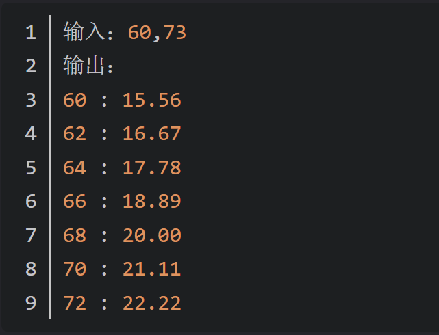
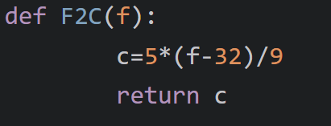
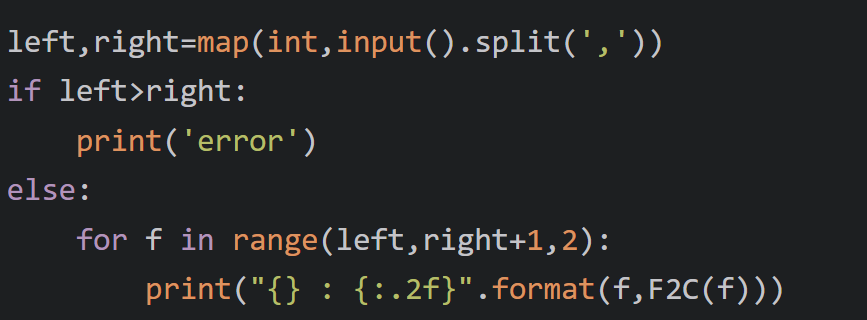

### 華氏度轉攝氏度速查表

## 描述

已知華氏溫度轉換攝氏溫度的計算公式：C=5×(F−32)/9，其中：C 表示攝氏溫度，F 表示華氏溫度。

編寫函數 F2C(f)將華氏溫度轉換為攝氏溫度，讀入兩個華氏溫度值 f1 和 f2，列印

範圍在 f1~f2 內，每次增加兩個華氏溫度刻度的速查表。

注意：如果 f1>f2，則直接列印 error。

## 輸入格式

輸入為一行，為兩個不小於 32 的正整數 f1 和 f2，表示兩個華氏溫度。兩個數之間用逗號隔開，形如 f1,f2。

## 輸出格式

如果 f1>f2，輸出 error。

如果 f1<=f2，則輸出華氏轉攝氏的溫度轉換速查表，速查表可能有多行，每行一個溫度轉換對，形如 f1 : c1，其中 c1 保留小數點兩位。速查表以 2 華氏度為刻度。

# 示例 1

# 示例 2

# 示例 3

# 示例 4

# 示例 5S

# 溫度轉換函式

# 主程式

輸入兩個整數比較大小,輸入格式為[int,int],第一個數字印出 error,否則印出
第一個整數到第二個整數的數值(累加 2 並轉換溫度)

